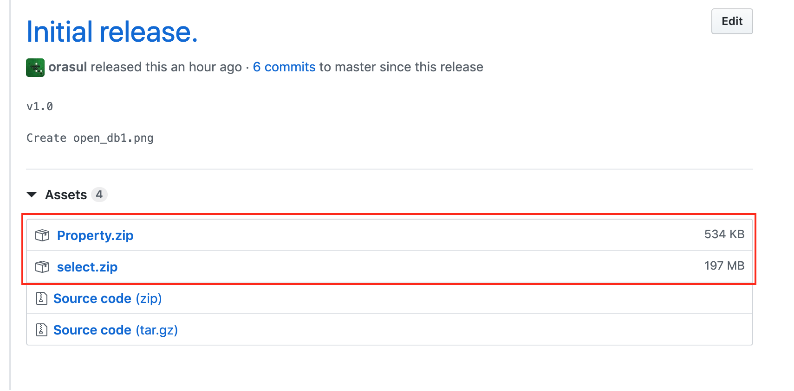
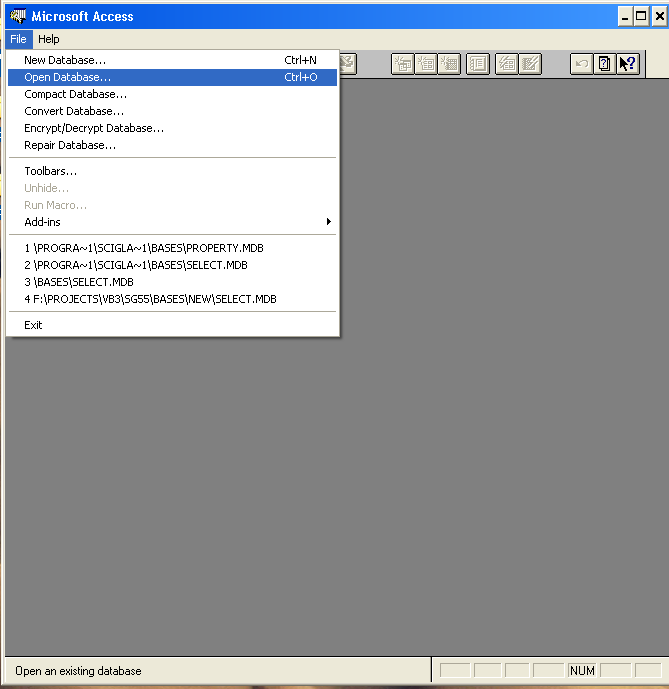
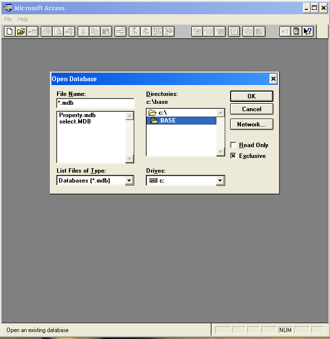
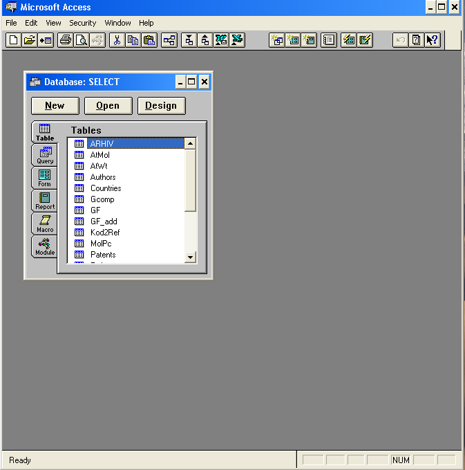
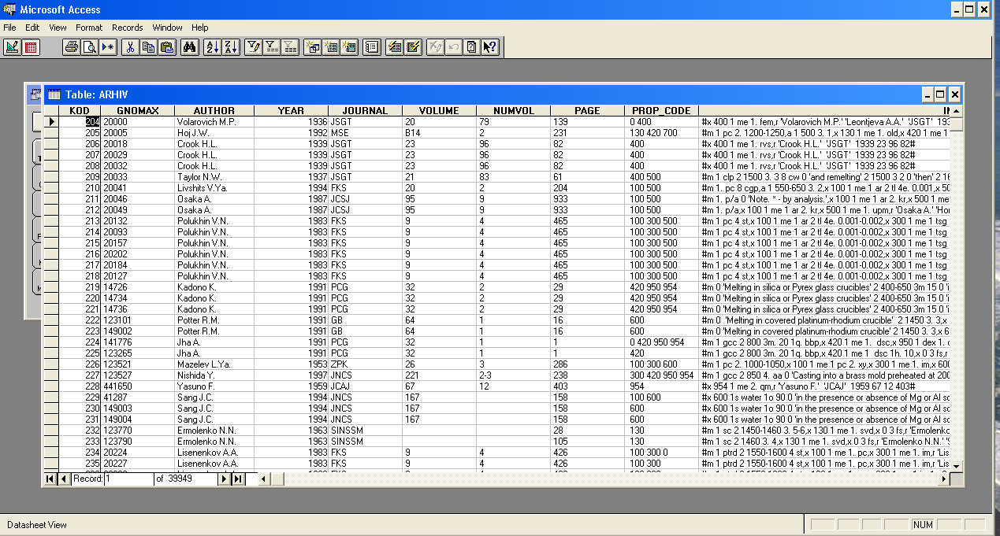

# SciGlass

The largest glass property database contains data for more than 420 thousand glass compositions including more than 18 thousand halide and about 38 thousand chalcogenide glasses. It provides also property predictions and calculations, help you solve R&D problems.

## Features
* Glass Properties. Practically all broadly used physical and chemical properties of glasses and glass-forming melts with concise but informative description of syntheses and measurement procedures.
* Glasses. 422,000 glasses and melts, including more than 268,000 oxide glasses and melts, 18,500 halide and 38,500 chalcogenide glasses.
The data were taken from more than 40,000 literature sources including more than 19,700 patents.
* Property Calculations. Over 100 computational methods to compute the properties in 15 groups (e.g., viscosity, density, mechanical, optical), many of them in broad temperature ranges. Prediction  of properties of oxide, halide, and chalcogenide glasses is possible in wide concentration ranges.
* Ternary Diagrams of Glass Formation. 
More than 3,800 ternary diagrams of glass formation.
* Optical Spectra. More than 15,000 optical spectra (from UV to near IR) for glasses and melts with 96 different ways to represent spectra.
* Ternary Property Diagram.Automatically generate isoproperty lines versus composition and compare calculated and experimental property values for ternary compositions.
* Statistical Analysis. Find best computational method from least squares fit of calculated and experimental values to insure best method can be applied to your glass composition.
* Patent and Trademark Index. Over 19,000 international patents and 1,000 trademarks; complete information on usage, country, company, composition, property table, author, and TM symbol.
* Subject Index. Explore hundreds of specialized subjects (e.g., diffusion of specific gases & ions), which are difficult to find by other ways.
* Chemical Durability of Glasses. Pertinent data on about 35,000 glasses as well as access to a large compendium on standard durability testing methods.
* Optimization of Glass Compositions. Find the most perspective glass compositions meeting a complex of requirements on specific values of their properties

 ## Usage

All operations are performed on a 32-bit operating system under Windows OS.
1.	Download the latest version of DB from releases folder: https://github.com/epam/SciGlass/releases

2. Put select.mdb and property.mdb to folder “C:\BASES”.
3.	Setup and Run Microsoft Access 2.0. 
4.	Using menu File -> Open Database 

5.	Open file select.mdb from folder “C:\BASES

6.	Go to the “ARHIV” table

7.	Open “ARHIV” table

